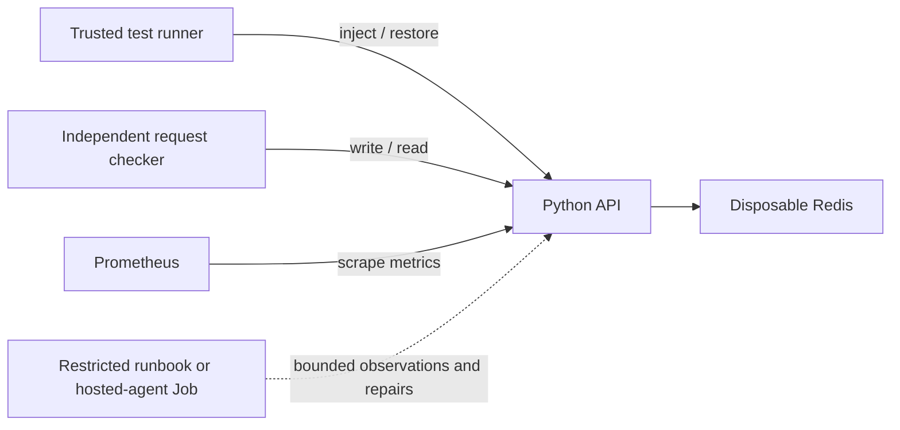

# RackOps

An evidence-grounded incident-response experiment for a disposable local
Kubernetes lab. **Work in progress:** all three repairable fault families,
unsupported escalation, and healthy no-op passed in one real GitHub Actions
kind smoke. A hosted-provider path now exists for the two LLM strategies, but
it has only offline transport tests. The LLM comparison and held-out benchmark
are unfinished.

The application stores short-lived values in Redis. The checker sends real
writes and reads and checks exact responses. The intended question is whether
a structured evidence/repair/verification workflow improves on a basic agent.
The full specification is in [PROJECT_BRIEF.md](PROJECT_BRIEF.md); current
acceptance status and blockers are in [docs/PROGRESS.md](docs/PROGRESS.md).



The coding assistant building this repository is different from the runtime
agent being evaluated. The basic and structured loops have scripted provider
tests and a bounded OpenAI Responses transport; no hosted model has run. The
operator CLI invokes Docker/kubectl and must never become an LLM tool.

## Run the tested fixture demo

Use Python 3.12. Commands start from the repository root. The existing local
checkout already has a `.venv`. A fresh checkout needs the setup steps below.

**Windows PowerShell:**

```powershell
py -3.12 -m venv .venv
.\.venv\Scripts\python.exe -m pip install -r requirements-dev.lock
.\.venv\Scripts\python.exe -m pip install --no-deps -e .
.\.venv\Scripts\python.exe -m pytest -q
.\.venv\Scripts\rackops.exe demo-fixture
.\.venv\Scripts\rackops.exe doctor
```

`py` is a prerequisite for the fresh setup command, not assumed installed.
The initial build used the desktop's bundled Python to create `.venv`.

**WSL/Linux:**

```bash
python3.12 -m venv .venv
.venv/bin/python -m pip install -r requirements-dev.lock
.venv/bin/python -m pip install --no-deps -e .
.venv/bin/python -m pytest -q
.venv/bin/rackops demo-fixture
.venv/bin/rackops doctor
```

Do not share the same `.venv` between Windows and WSL; recreate it in the
environment where you work. The fixture demo reports `execution_mode: fixture`
and `benchmark_eligible: false`: healthy requests succeed, the injected dependency
failure fails, and restoring configuration makes requests succeed again.

## Real Kubernetes lab

A **cluster** runs container workloads. A **Deployment** maintains application
Pods (running containers); a **Service** gives clients a stable address.
A **namespace** groups this disposable lab's resources.

Prerequisites: Docker in Linux-container mode, kind, kubectl, Python 3.12, and
enough currently available memory. See [Windows handoff](docs/windows-setup.md).
The first-session laptop had only about 4.2 GiB free; free memory before trying
the cluster and measure actual usage. No paid infrastructure is needed.

After installing this package, use `rackops` with `.venv/Scripts` (Windows) or
`.venv/bin` (Linux) on your terminal's PATH:

```text
rackops doctor
rackops lab up
rackops lab metrics
rackops lab inject
rackops lab baseline --expect verified_repair
rackops lab recover
rackops lab reset
rackops lab down
```

With an existing healthy cluster, `rackops evaluate-dev` runs the five known
development scenarios serially using the runbook. Repeat `--scenario NAME` to
select cases. It resets between attempts, performs a fresh 60-second trusted
request check after the Job, and writes JSONL to ignored
`results/raw/development.jsonl`.
This command is not a held-out benchmark. Two three-case CI executions completed
with 2/3 passing. The second identified stale image revision history causing a
Redis-host fault misclassification; current-Pod status and dependency-log
signals now replace that stale-history shortcut, pending a live rerun.

Before any holdout, `rackops calibrate-dev --runs 5` records five complete
healthy 60-second windows under ignored `results/raw/`. It recommends twice the
worst healthy p95 latency with a 50 ms floor and labels the result
`candidate_unfrozen`. Review and version that candidate separately; running the
command alone does not freeze or authorize a benchmark criterion.

`up` creates only the `rackops` cluster and refuses to adopt an existing one.
`inject` accepts `--scenario bad_redis_host`, `bad_service_port`, `bad_image`,
`redis_outage`, or `healthy`. All five passed a manual CI kind smoke; laptop
execution remains unverified. Injection requires a healthy baseline and checks
that the injected fault manifests before returning. The image case records rollout failure and
whether client requests also failed; these are separate outcomes.
`recover` restores the recorded pre-fault field with concurrent-change checks and validates
requests. `baseline` creates a Job using the restricted `rackops-agent` service
account; it uses operational clues and verifies any repair with a 60-second
request window. The Job passed all five CI cases, and Kubernetes Role allow/deny
checks passed in run 36371065150. `reset`
restores the checked-in baseline; `down` removes the disposable cluster.
Trusted runner recovery is separate from the gateway's field rollback.

For local access, in a separate terminal:

```text
kubectl --context kind-rackops -n rackops-lab port-forward --address 127.0.0.1 service/rackops-api 8000:8000
rackops smoke
rackops verify
```

Restart port forwarding after a deployment change: it may be attached to a
terminated Pod. The lab's internal checker uses fresh Jobs against the Service
so this does not distort its fault/recovery checks.

For metrics, forward Prometheus locally:

```text
kubectl --context kind-rackops -n rackops-lab port-forward --address 127.0.0.1 service/prometheus 9090:9090
```

Open `http://127.0.0.1:9090` and query
`sum(rate(rackops_http_requests_total{route="/items/{key}"}[1m]))`.
Logs and Kubernetes events are available through ordinary operator kubectl
commands. Runtime observation is bounded by the in-cluster adapter and gateway.

## Hosted basic and structured development runs

Hosted execution uses the OpenAI Responses API with `store: false`, a strict
JSON schema, one bounded decision call per attempt, and the same restricted
gateway and service account as the runbook. The trusted runner injects a
short-lived Secret into the Job and deletes it afterward; the agent Role cannot
read Kubernetes Secrets or access scenario truth. See the official
[Responses API](https://developers.openai.com/api/reference/cli/resources/responses/methods/create),
[Structured Outputs guide](https://developers.openai.com/api/docs/guides/structured-outputs),
and [current pricing](https://developers.openai.com/api/docs/pricing).

RackOps reads the six explicit settings in `.env.example` from the process
environment. It does not automatically read a `.env` file. Select a model that
supports strict Structured Outputs, supply its current standard input/output
prices per million tokens, and set the maximum total USD for one command. An
incorrect price setting makes the cap inaccurate, so verify prices immediately
before a run. Never commit or paste the API key into results or command arguments.

```text
rackops evaluate-dev --strategy basic --scenario healthy
rackops evaluate-dev --strategy structured --scenario bad_redis_host
```

The cap reserves every allowed retry before the first request. Returned token
usage and its priced cost are recorded. An ambiguous retry is conservatively
charged at its full reservation and marked as an incomplete cost observation; a
failed Job with unknown usage stops subsequent calls. These are development
runs and remain benchmark-ineligible. Zero paid calls have been made so far.

## Verification and limitations

```text
python -m ruff check .
python -m ruff format --check .
python -m pytest -q
```

Tests cover exact response checking, wrong repairs, dependency failures,
malformed input, metrics cardinality, operator recovery guards, fake-provider
strategy decisions, hosted schema validation, and pre-request cost limits. A transport
test exercises real HTTP and redis-py sockets against **simulated Redis**; it is
not a real Redis integration test. [Results](docs/results.md) report actual checks.

The 60-second checker uses a provisional 500 ms p95 limit. It is not calibrated
or frozen. `lab recover` uses a short smoke check, not that full window. No
repair-success percentage, cost comparison, or production reliability claim is
currently justified. Full independent scenario scoring remains a later
milestone. Fast CI and one manual kind smoke passed on GitHub.

Build the local selected-results dashboard from the checked-in JSON summaries:

```text
rackops report
```

Open `dashboard/index.html`. It is a static replay, labels fixture and live
kind evidence separately, and does not claim a benchmark result. See
[demo instructions](docs/demo.md) for a prepared-cluster walkthrough.

This repository contains original implementation code under the [MIT license](LICENSE);
no research-framework code was copied. The [research notes](docs/research.md)
identify project inspirations and limits. The [architecture](docs/architecture.md)
and [evaluation protocol](docs/evaluation.md) explain the current trust boundaries
and the planned comparison.
