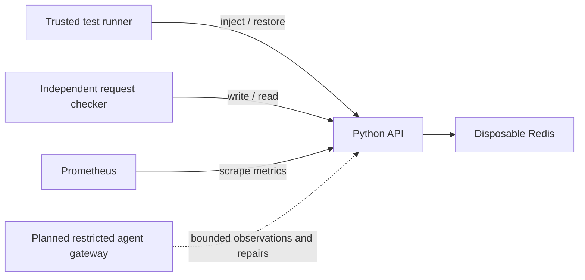

# RackOps

An evidence-grounded incident-response experiment for a disposable local
Kubernetes lab. **Work in progress: first application and dependency-fault slice.**
No LLM comparison or Kubernetes benchmark has been completed.

The application stores short-lived values in Redis. The checker sends real
writes and reads and checks exact responses. The intended question is whether
a structured evidence/repair/verification workflow improves on a basic agent.
The full specification is in [PROJECT_BRIEF.md](PROJECT_BRIEF.md); current
acceptance status and blockers are in [docs/PROGRESS.md](docs/PROGRESS.md).



The coding assistant building this repository is different from the runtime
agent planned for the experiment. No runtime agent exists yet. The operator
CLI invokes Docker/kubectl and must never become an LLM tool.

## Run the tested fixture demo

Use Python 3.12. Commands start from the repository root. The existing local
checkout already has a `.venv`. A fresh checkout needs the setup steps below.

**Windows PowerShell:**

```powershell
py -3.12 -m venv .venv
.\.venv\Scripts\python.exe -m pip install -r requirements-dev.lock
.\.venv\Scripts\python.exe -m pip install --no-deps -e .
.\.venv\Scripts\python.exe -m pytest -q
.\.venv\Scripts\rackops.exe demo-fixture
.\.venv\Scripts\rackops.exe doctor
```

`py` is a prerequisite for the fresh setup command, not assumed installed.
The initial build used the desktop's bundled Python to create `.venv`.

**WSL/Linux:**

```bash
python3.12 -m venv .venv
.venv/bin/python -m pip install -r requirements-dev.lock
.venv/bin/python -m pip install --no-deps -e .
.venv/bin/python -m pytest -q
.venv/bin/rackops demo-fixture
.venv/bin/rackops doctor
```

Do not share the same `.venv` between Windows and WSL; recreate it in the
environment where you work. The fixture demo reports `execution_mode: fixture`
and `benchmark_eligible: false`: healthy requests succeed, the injected dependency
failure fails, and restoring configuration makes requests succeed again.

## Real Kubernetes lab: implementation awaiting integration testing

A **cluster** runs container workloads. A **Deployment** maintains application
Pods (running containers); a **Service** gives clients a stable address.
A **namespace** groups this disposable lab's resources.

Prerequisites: Docker in Linux-container mode, kind, kubectl, Python 3.12, and
enough currently available memory. See [Windows handoff](docs/windows-setup.md).
The first-session laptop had only about 4.2 GiB free; free memory before trying
the cluster and measure actual usage. No paid infrastructure is needed.

After installing this package, use `rackops` with `.venv/Scripts` (Windows) or
`.venv/bin` (Linux) on your terminal's PATH:

```text
rackops doctor
rackops lab up
rackops lab inject
rackops lab recover
rackops lab reset
rackops lab down
```

`up` creates only the `rackops` cluster and refuses to adopt an existing one.
`inject` currently supports only the bad Redis hostname case. It requires a
healthy baseline and confirms failed real requests before returning.
`recover` restores the recorded host with concurrent-change checks and validates
requests. `reset` restores the checked-in baseline; `down` removes the disposable
cluster. Recovery is not the planned agent's rollback mechanism.

For local access, in a separate terminal:

```text
kubectl --context kind-rackops -n rackops-lab port-forward --address 127.0.0.1 service/rackops-api 8000:8000
rackops smoke
rackops verify
```

Restart port forwarding after a deployment change: it may be attached to a
terminated Pod. The lab's internal checker uses fresh Jobs against the Service
so this does not distort its fault/recovery checks.

For metrics, forward Prometheus locally:

```text
kubectl --context kind-rackops -n rackops-lab port-forward --address 127.0.0.1 service/prometheus 9090:9090
```

Open `http://127.0.0.1:9090` and query
`sum(rate(rackops_http_requests_total{route="/items/{key}"}[1m]))`.
Logs and Kubernetes events are available through ordinary operator kubectl
commands; bounded runtime-agent observation tools are still to be implemented.

## Verification and limitations

```text
python -m ruff check .
python -m ruff format --check .
python -m pytest -q
```

Tests cover exact response checking, wrong repairs, dependency failures,
malformed input, metrics cardinality, and operator recovery guards. A transport
test exercises real HTTP and redis-py sockets against **simulated Redis**; it is
not a real Redis integration test. [Results](docs/results.md) report actual checks.

The 60-second checker uses a provisional 500 ms p95 limit. It is not calibrated
or frozen. `lab recover` uses a short smoke check, not that full window. No
repair-success percentage, cost comparison, or production reliability claim is
currently justified. Runtime policy enforcement and independent scenario
scoring remain later milestones. CI is configured but has not run on GitHub.

This repository contains original implementation code; no research-framework
code was copied. Research pointers in the brief are project inspirations, not
claims of reproduction. A distribution license will be selected with the owner
before public publication; no third-party license notices have been removed.
