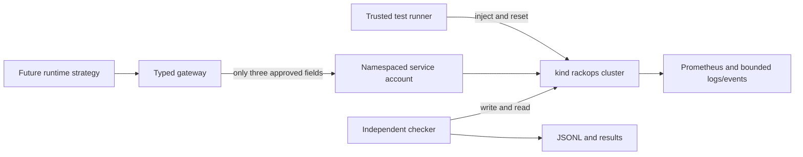

# Current architecture and trust boundaries

The operator CLI currently uses the human's local Docker and kubectl to create
and reset the disposable lab. It is outside the runtime agent's tool surface.
The future runtime is designed to run in-cluster with `rackops-agent`, a Role
that can read named lab resources and patch only the API Deployment or Service.
RBAC cannot restrict individual fields, so `gateway.py` and `kube_backend.py`
also check resource identity, field names, types, and resource versions. Actual
RBAC behavior against Kubernetes has not yet been exercised.

The gateway stores bounded observations with stable IDs. A proposal must cite
existing IDs, but their existence does not prove the diagnosis. A repair is
pending until an independent checker accepts or rejects it. A rejected repair
may be rolled back to its immediate pre-action field value, which can still be
the faulty incident state. The trusted runner's final reset is a separate step.

Three fault fields are planned for runtime repair: the API Deployment's Redis
host, that Deployment's image, and the API Service's target port. The test
runner can also scale Redis to zero; the runtime Role cannot patch Redis.
The real cluster, runtime Pod, and end-to-end action loop remain unverified.
