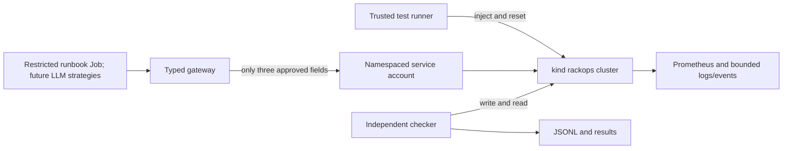

# Current architecture and trust boundaries

The operator CLI currently uses the human's local Docker and kubectl to create
and reset the disposable lab. It is outside the runtime agent's tool surface.
The runbook Job runs in-cluster with `rackops-agent`, a Role
that can read named lab resources and patch only the API Deployment or Service.
RBAC cannot restrict individual fields, so `gateway.py` and `kube_backend.py`
also check resource identity, field names, types, and resource versions. In
manual CI run 36371065150, Kubernetes allowed the named API Deployment patch
and denied Redis Deployment patching, secret listing, and Pod patching. The
gateway's finer field restrictions have offline tests; the live CI job only
uses its supported fields.

The gateway stores bounded observations with stable IDs. A proposal must cite
existing IDs, but their existence does not prove the diagnosis. A repair is
pending until an independent checker accepts or rejects it. A rejected repair
may be rolled back to its immediate pre-action field value, which can still be
the faulty incident state. The trusted runner's final reset is a separate step.

Three fault fields are allowed for runtime repair: the API Deployment's Redis
host, that Deployment's image, and the API Service's target port. The test
runner can also scale Redis to zero; the runtime Role cannot patch Redis.
The restricted runbook Job repaired all three fault families in the real CI
kind smoke. The trusted development runner also scores a fresh request check
after the Job; its own live integration is pending. Hosted LLM strategies and
held-out comparison remain future work.
